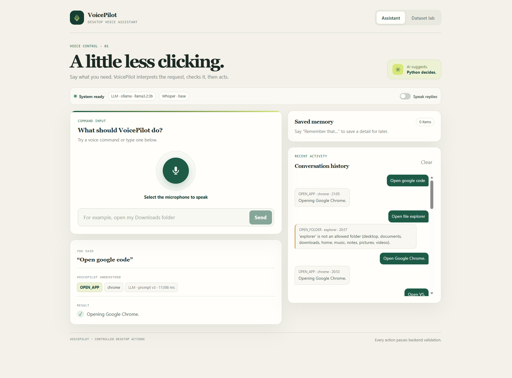

# VoicePilot – AI-powered voice assistant for desktop task automation
**DA598A Introduction to Generative AI – project work · Richmond Boakye**
A voice assistant that turns spoken requests into controlled desktop actions. Built as project work for **DA598A Introduction to Generative AI** by Richmond Boakye.

VoicePilot transcribes speech with faster-whisper, uses an LLM to interpret the request, then checks the proposed action against an allowlist before Python executes it.

## Screenshots

### Assistant


### Dataset recorder



## Features

- Record or type a command in the React interface.
- Open approved applications, folders, and web searches.
- Create notes, save and recall memories, and summarise clipboard text.
- View conversation history and optionally hear spoken replies.
- Record labelled voice commands for the project dataset.
- Fall back to local classifier and keyword rules if the LLM is unavailable.

The LLM can suggest an intent, but it cannot run commands directly. The Python backend validates each action against an allowlist. Unsupported requests are rejected.

## Technology

- **Frontend:** React, TypeScript, Vite
- **Backend:** Python, FastAPI
- **Speech recognition:** faster-whisper
- **Intent interpretation:** Ollama, Groq, OpenAI, or offline mode
- **Offline classifier:** scikit-learn TF-IDF and Logistic Regression
- **Storage:** SQLite

## The process
You speak to VoicePilot in the browser. Your speech is turned into text with **Whisper**, an **LLM** works out what you want (with conversation history and saved memories in the prompt), and a **Python backend** checks the action against an allowlist before running it.

```
 Microphone (React + TypeScript)
        │  audio (.webm)
        ▼
 FastAPI  ──► speech.py     faster-whisper (local)         "could you open vs code"
        ──► assistant.py  LLM + prompt v3 (memory/history) {"intent":"OPEN_APP","target":"vscode"}
        ──► actions.py    allowlist validation             ✓ allowed
        ──► actions.py    executor                         VS Code opens
        ──► memory.py     SQLite (history + memories)      logged
        ▼
 UI shows: You said → AI understood → Status   (optional spoken reply)
```

The LLM can only **suggest** one of 7 intents. Python decides whether it is allowed. The model never gets to run its own commands.

| Intent | Example | What happens |
|---|---|---|
| `OPEN_APP` | "Could you open Visual Studio Code?" | launches an allow-listed app (chrome, edge, firefox, vscode, calculator, notepad, explorer, word, excel, spotify) |
| `OPEN_FOLDER` | "Show my Downloads" | opens downloads / documents / desktop / pictures / music / videos / home / notes |
| `WEB_SEARCH` | "Search Google for FastAPI tutorials" | opens a Google search in the default browser |
| `CREATE_NOTE` | "Create a note saying I must finish my report" | writes a `.txt` file to `~/VoicePilot Notes` |
| `SAVE_MEMORY` | "Remember that my presentation is on Friday" | stores the fact in SQLite |
| `RECALL_MEMORY` | "What did I ask you to remember about Friday?" | LLM answers using only the saved memories |
| `SUMMARIZE_CLIPBOARD` | "Summarize what's in my clipboard" | LLM summarises the copied text in 3 bullet points |
| `UNKNOWN` | "Delete all my files" | politely rejected |

---

## 1. Installation (Windows, macOS or Linux)

**Requirements:** Python 3.10+ and Node.js 18+. You need about 1 GB of disk space for the Whisper and LLM models.

### Quick way (Windows)
1. Double-click **`setup_windows.bat`**. It creates a virtual environment, installs everything, builds the dataset and trains the classifier.
2. Choose your LLM in `backend\.env` (see step 3 below).
3. Double-click **`run_windows.bat`**. The app opens at http://localhost:5173.

### Manual way (all operating systems)
```bash
# 1) backend
python -m venv .venv
.venv\Scripts\activate            # Windows   (macOS/Linux: source .venv/bin/activate)
pip install -r backend/requirements.txt
cp backend/.env.example backend/.env   # Windows: copy backend\.env.example backend\.env

# 2) dataset + offline classifier (optional, but recommended)
python scripts/preprocess.py
python scripts/train_classifier.py

# 3) start the API (terminal 1)
cd backend
uvicorn app.main:app --reload            # http://127.0.0.1:8000/docs = Swagger UI

# 4) start the UI (terminal 2)
cd frontend
npm install
npm run dev                              # open http://localhost:5173
```
The first voice command downloads the Whisper `base` model (~150 MB), so it takes a little longer.

### Choosing the LLM (in `backend/.env`)
All options use the same OpenAI-compatible code. Only the `.env` setting changes.

| `LLM_PROVIDER` | Cost | Setup |
|---|---|---|
| `ollama` *(default, recommended)* | **Free**, runs on your PC | Install [Ollama](https://ollama.com/download), then run `ollama pull llama3.2:3b` and keep Ollama running |
| `groq` | **Free tier** (rate-limited) | Create a key at https://console.groq.com/keys and set `GROQ_API_KEY=...` |
| `openai` | Paid but cheap (`gpt-4o-mini`, a fraction of a cent per command) | Set `OPENAI_API_KEY=...` |
| `none` | Free, no setup | No LLM. A trained TF-IDF classifier plus rules interpret the command. Recall/summary become simple keyword/extractive answers |

If the LLM can't be reached, VoicePilot automatically falls back to the offline classifier. The UI then shows `via classifier (LLM unavailable)`.

Set `DRY_RUN=1` to test without anything actually opening.

---

## 2. Using the app
* **Assistant tab:** click the microphone, speak, then click again to send. You can also type a command. The result card shows *You said → AI understood → Status*. The right side shows your saved memories and the conversation history. Tick **Speak replies** to hear the answer, using the browser's built-in text-to-speech.
* **Dataset tab:** pick an intent label, record yourself saying a command and it is saved to `data/raw/audio/` + `data/raw/recorded_commands.csv`. These raw recordings are transcribed and cleaned by `scripts/preprocess.py`.

---

## 3. Data, preprocessing and evaluation

```
data/raw/commands_raw.csv        seed set: typed / paraphrased / transcribed commands (messy on purpose)
data/raw/recorded_commands.csv   your own voice recordings (created by the Dataset tab)
        │  scripts/preprocess.py
        ▼
 transcribe audio with Whisper → drop empty/noise rows ("[inaudible]", "...", 1-word) →
 normalise text (case, whitespace, filler words "um/uh/hey voicepilot") →
 map the many label spellings ("open app", "Open_App", "openapp") to 8 canonical labels →
 validate targets ("crome" → chrome) → remove duplicates → stratified 70/15/15 split
        ▼
data/processed/{dataset_clean,train,val,test}.csv + preprocessing_report.json
        │  scripts/train_classifier.py   (TF-IDF word + char n-grams → Logistic Regression)
        │  scripts/evaluate_prompts.py   (rules vs classifier vs prompt v1 / v2 / v3)
        ▼
results/classifier_report.txt, results/prompt_evaluation.{md,csv}
```

Current numbers with the seed data (`preprocessing_report.json`): **230 raw rows → 201 clean rows**. 8 noise rows, 1 unlabelled row, 2 invalid targets and 18 duplicates were removed. Split: 140 / 30 / 31.

| Method (test split, 31 samples) | Intent accuracy |
|---|---|
| Keyword rules | 96.8 % |
| TF-IDF + Logistic Regression | 90.3 % |
| LLM prompt v1 / v2 / v3 | run `python scripts/evaluate_prompts.py` with your LLM running |


### Prompt versions (`backend/app/assistant.py`)
* **v1** – one line: "Determine what action the user wants", plus the list of intents.
* **v2** – adds a role, a definition for every intent, rules for the target, the allowed apps/folders, "JSON only", and a note that speech recognition makes mistakes.
* **v3** – v2 plus **few-shot examples**, **saved memories**, the **last 5 conversation turns** (so "open it again" works), an explicit rule for questions vs statements, safety rules for UNKNOWN, and a short spoken `reply`.

`PROMPT_VERSION` in `.env` picks the version the app uses. The evaluation script compares all three.

---

## 4. Project structure
```
voicepilot/
├── backend/
│   ├── app/
│   │   ├── main.py        FastAPI endpoints + the pipeline
│   │   ├── speech.py      faster-whisper speech-to-text
│   │   ├── assistant.py   prompts v1–v3, LLM calls, JSON parsing, recall + summary
│   │   ├── actions.py     allowlists, validation, desktop actions
│   │   ├── fallback.py    offline classifier / keyword rules
│   │   ├── memory.py      SQLite history + memories
│   │   ├── models.py      Pydantic models
│   │   └── config.py      settings from .env
│   ├── models/intent_classifier.joblib
│   ├── requirements.txt
│   └── .env.example
├── frontend/   React + TypeScript + Vite
│   └── src/ App.tsx, components/ (VoiceRecorder, ActionCard, ConversationHistory,
│            MemoryPanel, StatusIndicator, DatasetRecorder), services/ (api, useRecorder), types/
├── data/       raw/ and processed/
├── scripts/    preprocess.py, train_classifier.py, evaluate_prompts.py
├── results/    evaluation output
├── tests/      pytest (run `pytest -q` from the project root)
└── docs/REPORT_NOTES.md   notes to help write the final report
```

API overview (try it in Swagger at http://127.0.0.1:8000/docs):
`GET /api/health` · `POST /api/command {text}` · `POST /api/voice (audio)` · `POST /api/transcribe` · `GET/DELETE /api/history` · `GET /api/memories` · `DELETE /api/memories/{id}` · `POST /api/dataset/sample` · `GET /api/dataset/count`

---

## 5. Troubleshooting
* **"Backend offline" in the UI**: start `uvicorn app.main:app` inside the `backend` folder.
* **Microphone doesn't work**: allow microphone access in the browser. Use `http://localhost:5173`, not an IP address, because browsers only allow the microphone on localhost/https.
* **App doesn't open on Windows**: `chrome`/`code` have to be installed. VS Code needs "Add to PATH" ticked during install.
* **Clipboard on Linux**: install `xclip` (`sudo apt install xclip`).
* **Slow transcription**: set `WHISPER_MODEL=tiny` in `.env`.

---

## 6. References (public code, libraries and documentation used)
Code comments in each file point to the specific source it follows.

**Speech / AI**
1. Radford et al. (2022). *Robust Speech Recognition via Large-Scale Weak Supervision* (Whisper). https://arxiv.org/abs/2212.04356 · https://github.com/openai/whisper
2. SYSTRAN – faster-whisper (usage example in `speech.py`). https://github.com/SYSTRAN/faster-whisper
3. OpenAI Python SDK. https://github.com/openai/openai-python
4. Ollama – OpenAI compatibility. https://ollama.com/blog/openai-compatibility · Llama 3.2 model: https://ollama.com/library/llama3.2
5. Groq – OpenAI compatibility. https://console.groq.com/docs/openai
6. OpenAI – Prompt engineering guide (few-shot, clear instructions, structured output). https://platform.openai.com/docs/guides/prompt-engineering
7. Brown et al. (2020). *Language Models are Few-Shot Learners*. https://arxiv.org/abs/2005.14165

**Backend**
8. FastAPI docs – first steps, request files, CORS, testing, lifespan events. https://fastapi.tiangolo.com/tutorial/
9. Pydantic models. https://docs.pydantic.dev/latest/concepts/models/
10. Python `sqlite3` tutorial. https://docs.python.org/3/library/sqlite3.html#tutorial
11. Python `subprocess`, `webbrowser`, `os.startfile`. https://docs.python.org/3/library/subprocess.html · https://docs.python.org/3/library/webbrowser.html · https://docs.python.org/3/library/os.html#os.startfile
12. pyperclip (clipboard). https://github.com/asweigart/pyperclip
13. python-dotenv. https://github.com/theskumar/python-dotenv

**Data / ML**
14. scikit-learn – Working with text data (TF-IDF + linear classifier). https://scikit-learn.org/stable/tutorial/text_analytics/working_with_text_data.html
15. scikit-learn – FeatureUnion, train_test_split, classification_report. https://scikit-learn.org/stable/modules/compose.html
16. pandas – 10 minutes to pandas. https://pandas.pydata.org/docs/user_guide/10min.html

**Frontend**
17. Vite – React + TypeScript template and dev-server proxy. https://vitejs.dev/guide/ · https://vitejs.dev/config/server-options.html#server-proxy
18. React docs (hooks: useState, useEffect, useRef, custom hooks). https://react.dev/learn
19. MDN – MediaStream Recording API (`useRecorder.ts`). https://developer.mozilla.org/en-US/docs/Web/API/MediaStream_Recording_API/Using_the_MediaStream_Recording_API
20. MDN – Web Speech API `SpeechSynthesis` (spoken replies). https://developer.mozilla.org/en-US/docs/Web/API/SpeechSynthesis
21. MDN – Fetch API / FormData. https://developer.mozilla.org/en-US/docs/Web/API/Fetch_API/Using_Fetch

**Use of generative AI tools:** parts of this code base were drafted with the help of an AI coding assistant (Chatgpt). See `docs/REPORT_NOTES.md` 
